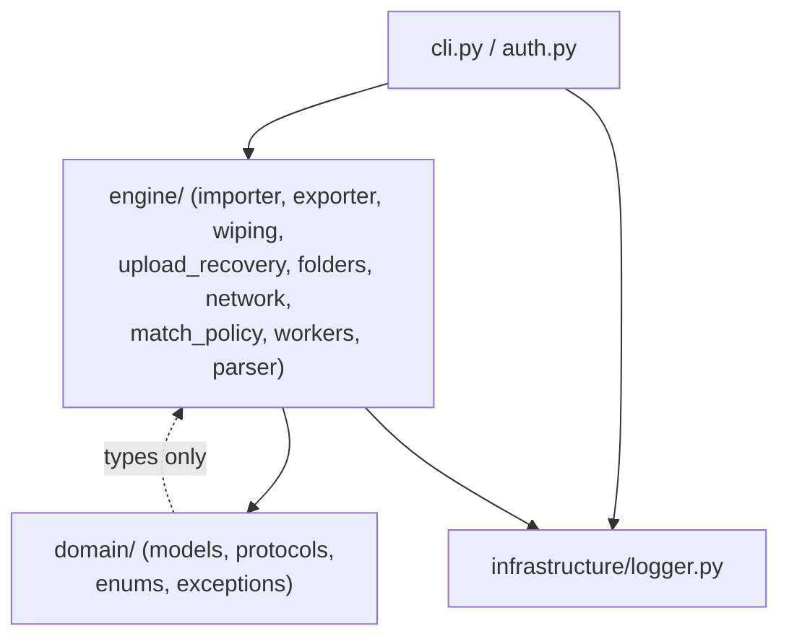
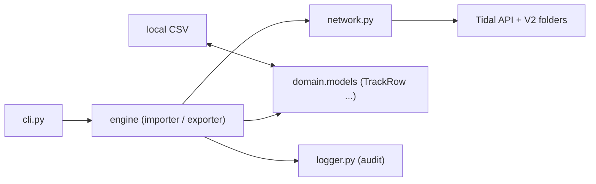
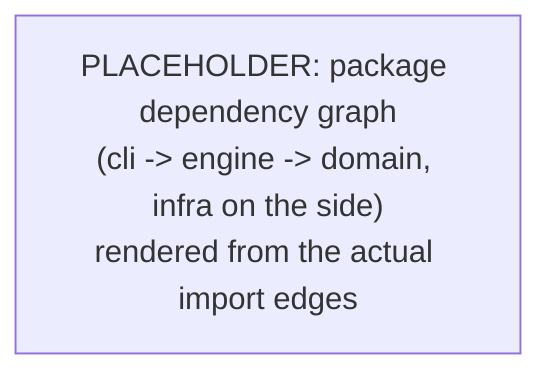

# Architectural Overview

## Purpose and scope

This document describes how tidal-sync is put together: the layers it is split into, what each module is responsible for, and how data moves through the system. It is written for two readers.

- New contributors who need a map of the source tree before they touch any code.
- Maintainers who need to confirm a change stays inside the right layer and respects the invariants below.

It covers the package under `src/tidal_sync`: the CLI, the engine, the domain models and types, and the logging infrastructure. It does not cover build, packaging, or the test suite in detail. For step by step setup, see [getting-started.md](getting-started.md). For the exact command set, see [cli-reference.md](cli-reference.md). The full request level sequence lives in [data-flow.md](data-flow.md), and the audit log format in [telemetry.md](telemetry.md).

## High-level architecture

tidal-sync is organised into three layers. Dependencies point downward only: the CLI depends on the engine, the engine depends on the domain, and the infrastructure is imported wherever logging is needed. The domain layer depends on nothing inside the package.



- **Domain layer** (`domain/`): pure types and rules. `models.py`, `protocols.py`, `enums.py`, `exceptions.py`. No I/O, no Tidal, no logging side effects.
- **Engine layer** (`engine/`): orchestration, network access, and file IO. It turns domain objects into Tidal calls and CSV rows.
- **Infrastructure layer** (`infrastructure/`): cross-cutting concerns that are neither domain logic nor engine flow. Today this is `logger.py` (telemetry).

A note on typing: `src/tidal_sync/__init__.py` exists, so mypy resolves cross-package imports (`tidal_sync.domain.*` and `tidal_sync.engine.*`) rather than treating the tree as loose modules. Every source file carries the AGPL header that `__init__.py` carries, and mypy is expected to report zero errors across the tree (see Key invariants).

## Component responsibilities

One paragraph per module. Claims here were checked against the current source.

### `cli.py` (Terminal interface)

The entry point. Typer routes `login`, `logout`, `import`, `export`, `clear`, and `profiles`. It validates arguments, selects the account profile, opens the audit log for the run, and calls the matching engine function inside `asyncio.run`. It is also the final error handler: it catches `TidalAuthenticationError` and `TidalSyncError` (plus `ValueError` on import) and turns them into a clean `typer.Exit(1)` instead of a raw stack trace.

### `auth.py` (State and security)

Owns the OAuth lifecycle and local token storage. `get_session` loads a cached token, refreshes it through Tidal, and on success re-saves it; otherwise it starts a fresh `login_oauth_simple` flow. It refuses to bind one Tidal account to two profile names (`_check_account_collision`), writes tokens with `0o600` from the moment the file is opened, and validates the profile name against a strict regex so `--profile` cannot escape the config directory. On logout, `secure_delete_token` zero-fills the file, verifies the overwrite, then deletes it.

### `importer.py` (Ingestion and metadata translation)

Coordinates bulk import of CSV backups into a Tidal account. `import_collection_from_disk` walks a file or directory, routes each CSV by filename (for example `Liked Songs.csv` goes to favourites), and prints the final `ImportStats` report. `resolve_track_to_id` turns local metadata into a Tidal id via direct id, ISRC search, or text search. The per-track worker `_resolve_track_metadata_to_id` wraps the lookup in `try/except` and records a failure instead of raising, so one bad track does not cancel the whole `TaskGroup`. Batch uploads go through `upload_recovery`, and V2 folder placement is handled via `folders`.

### `exporter.py` (Extraction and serialisation)

Pulls a Tidal library back down to local CSV. `export_user_favourites_to_disk`, `export_user_playlists_to_disk`, and `export_algorithmic_mixes_to_disk` each fetch through `network` and write via `parser`. Per-playlist and per-station failures are caught so a single bad item does not cancel the `TaskGroup`. It also captures point-in-time snapshots of dynamic mixes and rebuilds the user's V2 folder hierarchy on disk.

### `wiping.py` (Destructive clearance)

Removes data from a Tidal account behind `ClearTarget`. `purge_target_category_async` fans out deletions through headless worker groups and reports a `PurgeReport` (requested, deleted, failed) rather than absorbing errors: a wipe that reports success while deleting nothing is worse than no wipe. For folders it counts each target in `report.requested` even on a dry run, so the count matches what a live run would attempt (dry-run parity). It also uses a raw HTTP bypass to remove undocumented V2 ghost folders.

### `upload_recovery.py` (Fault isolation for uploads)

Keeps a partially refused batch from failing wholesale. `upload_batch_with_recovery` tries the whole chunk first and drops tracks Tidal named in its `UploadOutcome`. Only on a full exception does it fall back to a linear per-item rescan. Auth, rate-limit, and server errors (anything not a 403/404 or `ObjectNotFound`) propagate rather than being blamed on a track.

### `folders.py` (Raw V2 folder access)

Owns the undocumented V2 folder endpoints that `tidalapi` does not expose. Every call goes through `network.execute_network` so folder traffic obeys the global gate. Calls use raw `session.request.request` with browser-style headers (`deviceType=BROWSER`) and an empty body that forces the `Content-Length: 0` Tidal's firewall requires. `session.request.request` returns the raw `Response` and never parses JSON, so this module reads `.json()` itself. These calls were reverse-engineered from the web player; changing one breaks folder management against a real account in a way unit tests cannot catch.

### `network.py` (Gatekeeper and transport)

Centralises every Tidal API call. `GlobalTidalGate` watches for rate limits (429) and abuse flags (403): when one worker is throttled it extends a shared backoff window, and sibling workers sleep in their pre-flight check instead of opening new connections, which prevents account bans. `execute_network` runs a synchronous Tidal call on a thread behind the gate with bounded retries. `fetch_all_async` paginates exhaustively (with a page-signature guard so an offset-ignoring endpoint cannot loop forever). `fetch_blocked_artists` reads the user blocklist through the same guard. `CHUNK_SIZE` (50) lives here because it is a transport limit.

### `match_policy.py` (Import decisions)

Decides what happens to one matched item: add it, skip it as a duplicate, or record it as failed. `decide` holds the `ImportStats` lock across the duplicate check and the add, so two workers matching the same item cannot both treat it as new. This is import domain policy, so it sits beside `ImportStats` rather than in the concurrency module that merely runs the work.

### `workers.py` (Concurrency and counters)

Provides the async machinery the engine shares. `ImportStats` is an async-safe aggregator (added, skipped, failed) with a lock. `run_matching_tasks_async` and `run_headless_tasks_async` both bound concurrency with an `asyncio.Semaphore` (10) inside an `asyncio.TaskGroup`. Note the boundary: `cli.export_all` and `export_user_favourites_to_disk` build bare `TaskGroup` fan-outs of three to four tasks that run outside the semaphore, so the semaphore bounds the importer and the per-item export loops, not every export entry point.

### `parser.py` (CSV parsing and sanitisation)

Reads and validates CSV into Pydantic models. `parse_csv` tries UTF-8-SIG, then CP1252, then Latin-1, and drops malformed rows rather than halting the queue. `normalises_playlist_id` reconciles V1/V2 id differences, `sanitize_filename` clamps names for safe paths, and the `UniquePathAllocator` hands out non-colliding `.csv` paths within an export run. The atomic write helpers build a `.part` sibling and rename it into place so a crash leaves the previous backup intact.

### `models.py` (Domain validation)

Pydantic schemas `TrackRow`, `AlbumRow`, `ArtistRow` that normalise legacy Exportify or TuneMyMusic CSV formats into one canonical snake_case form per field. They drop malformed rows and carry the ISRC and direct id fields the importer uses as fallbacks when text search is needed.

### `protocols.py` (Structural typing)

Defines `TidalUser`, a `Protocol` describing the narrow surface of a `tidalapi` user the engine touches (id, favorites, playlists, create_playlist). `tidalapi` ships no type information, so this keeps static analysis honest without third-party stubs or `Any` casts.

### `enums.py` (Constrained choices)

Holds `StrEnum` classes, led by `ClearTarget` (all, tracks, albums, artists, playlists). Binding Typer arguments to these gives native validation and terminal autocomplete, so an unsupported category string cannot reach the engine.

### `exceptions.py` (Error hierarchy)

The custom domain exceptions: `TidalSyncError` (base), `TidalAuthenticationError`, `TidalRateLimitError`, `TidalTransientError`, and `TidalPoisonError` (one specific item must be dropped). The engine raises these expected errors; the CLI formats them instead of relying on abrupt `SystemExit` calls.

### `logger.py` (Telemetry)

Centralised logging on top of loguru and `orjson`. `setup_global_logging` sends console warnings to stderr; `setup_audit_logging` opens a JSONL audit sink with rotation and retention. `json_formatter` pre-serialises each record into the log `extra` dict to bypass loguru template injection when track names are untrusted, and `redact` scrubs session ids, bearer tokens, and token fields before anything reaches disk.

## Data flow and interactions

An import run moves data like this: the CLI opens an audit log, loads a session, and calls `import_collection_from_disk`. The importer parses CSV into `TrackRow` objects, resolves each to a Tidal id (domain + network), applies the match policy, and uploads accepted ids in chunks through `upload_recovery`, which talks to Tidal via `network`. An export run moves the same path in reverse: engine fetches through `network`, serialises to CSV via `parser`, and writes to disk.



The CSV files on disk are the boundary between a user's export and a later import; both sides validate through the same `models.py` schemas. For the full step by step sequence across every command, see [data-flow.md](data-flow.md).

## Concurrency model

Concurrency rests on three primitives:

- **`asyncio.Semaphore(10)`** in `workers.py` bounds how many network calls run at once for the importer and the per-item export loops.
- **`asyncio.TaskGroup`** groups the bounded tasks and propagates cancellation, which is why the engine wraps each worker body in `try/except` so one failure does not sink the batch.
- **`GlobalTidalGate`** coordinates across tasks: a 429 or 403 from any worker extends a shared backoff window that every worker's pre-flight check honours.

The CLI's two top-level export fan-outs (`export_all`, `export_user_favourites_to_disk`) use bare `TaskGroup`s of a few tasks outside the semaphore, so the semaphore is an engine-level bound, not a process-wide one. Every audit-relevant step is logged through `logger.bind(audit=True)`; the resulting JSONL format and redaction rules are in [telemetry.md](telemetry.md).

## Key invariants

These are expected to hold at all times. CI does not block on every one, but a change that breaks them is a regression.

- **AGPL headers.** Every source file opens with the GNU Affero General Public License header (see `__init__.py`). The package is licensed `AGPL-3.0-or-later`.
- **mypy 0 errors.** The package layout and the `TidalUser` protocol exist so mypy resolves cross-package types and reports zero errors across `src/tidal_sync`. Add `warn_unused_ignores = true` is set, so dead ignores fail.
- **ruff clean.** Ruff runs with `E, F, I, UP, B, SIM` selected at line length 100. New code should pass `ruff check`.
- **tests green.** `pytest` runs with `asyncio_mode = "auto"` against `tests/`. A change must not leave the suite red.

## Diagram placeholders

The two diagrams above are the canonical views. The placeholders below mark where a deeper rendered diagram would go once a diagram tool is wired into the docs build.



```mermaid
sequenceDiagram
    PLACEHOLDER["PLACEHOLDER: import run sequence\ncli -> importer -> parser -> network -> Tidal\nwith upload_recovery retry loop shown"]
    note right of PLACEHOLDER: See data-flow.md for the real sequence.
```

## Related documents

- [getting-started.md](getting-started.md) - install and first run.
- [data-flow.md](data-flow.md) - full request level sequence for every command.
- [cli-reference.md](cli-reference.md) - every command and option.
- [telemetry.md](telemetry.md) - audit log format and redaction.
- [acceptance.md](acceptance.md) - what the test suite must prove.
- [README.md](../README.md) - repository root overview.
- [docs/README.md](README.md) - index of this documentation set.
